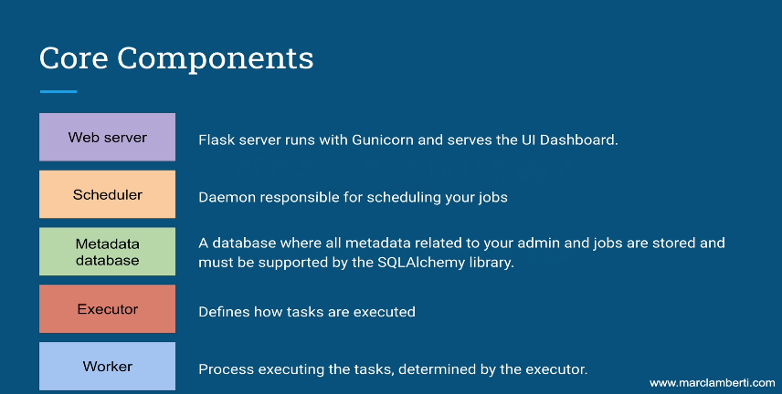
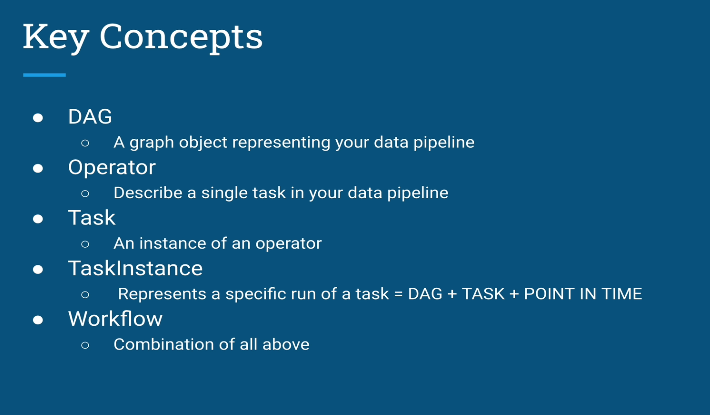
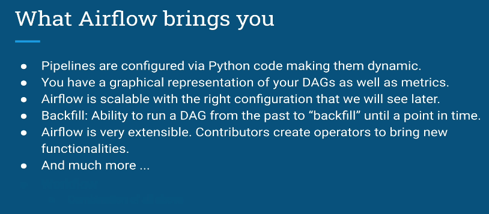
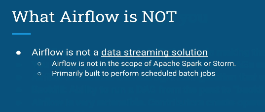
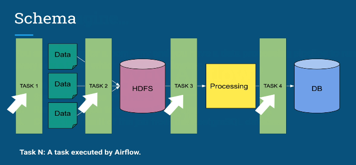
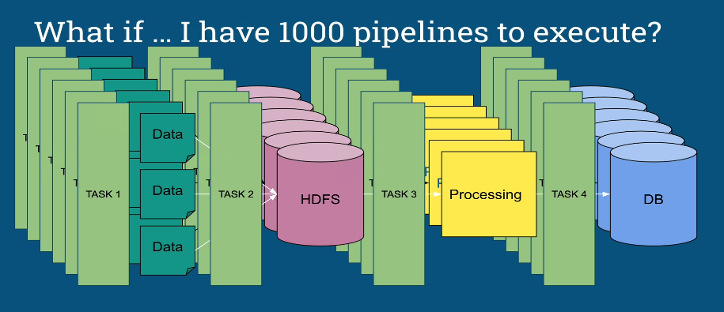
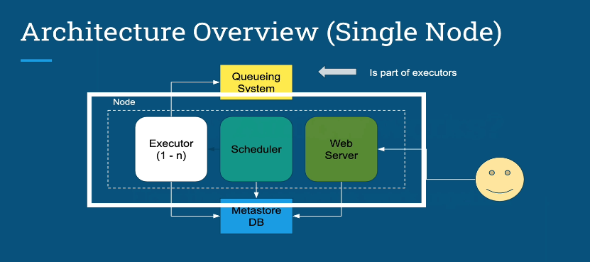
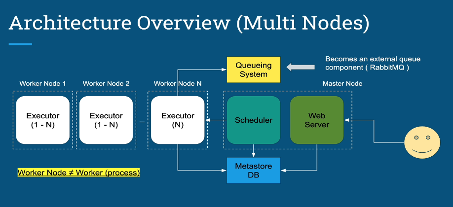
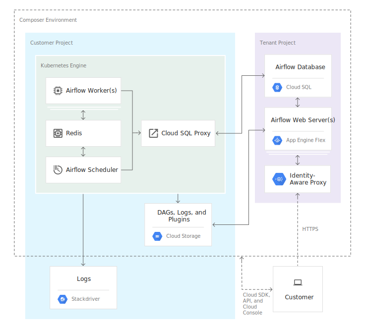

## Airflow Fundamental
### The concept

- Components

   

- Key Concepts in Airflow

   

- benefit of airflow

   

- this is not

   

- Case for airflow utilities

   

- How to manage so many kind of pipelines

   

- architecture using one node

   

- architecture using multiple node

   

- comparing with Google Composer

   

