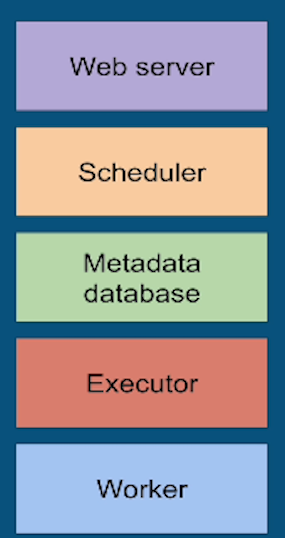

## Airflow Fundamental
### The concept

- Components

   

- Key Concepts in Airflow

   

- benefit of airflow

   

- this is not

   

- Case for airflow utilities

   

- How to manage so many kind of pipelines

   

- architecture using one node

   

- architecture using multiple node

   

- comparing with Google Composer

   

- first scheduler reads dag folder n see if it's scripts meets the criteria

   

- if meets then create DagRun in DB, registering it's scripts so then DagRun is Running

   

- schedule TaskInstances to run then TaskInstance Scheduled

   

- Scheduler send TaskInstance to Executor, Executor send TaskInstance to Queueing System then TaskInstance Queued

   

- Executor pulls out TaskInstance then updates the TaskInstance in MetaDB to running , so then Worker executing TaskInstance

   

- After Task Finished, Executor will updates TaskInstance to Success but DagRun still running to next task in that Dag

   

- After All Task Finished in Dag, Scheduler will updates to MetaDB DagRun Success, or if one task is fail so DagRun will update to Failed

   

- Web Server read MetaDB to Update UI

   

- Summaries

   

1. The Scheduler reads the DAG folder
2. Your DAG is parsed by a process to create a DagRun based on the scheduling parameter of your DAG
3. A TaskInstance is instantiated for each Task that needs to be executed and flagged to "Scheduled" in the metadata database
4. The Scheduler gets all TaskInstance flagged "Scheduled" from the metadata database, changes the state to "Queued" and sends them to the executors to be executed.
5. Executors pull out Tasks from the queue (depending on your execution setup), changes the state from "Queued" to "Running" and Workers start executing the TaskInstances
6. When a Task is finished, the Executor changes the state of that task to its final state (success, failed, etc) in the databse and the DagRun is updated by the Scheduler with the state "Success" or "Failed" of course, the web server periodically fetch data from metadaDB to update the UI