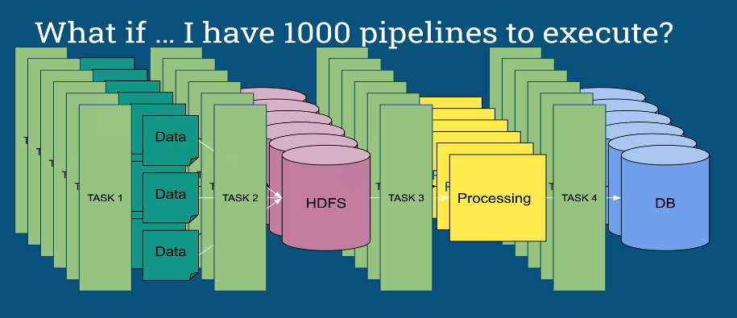
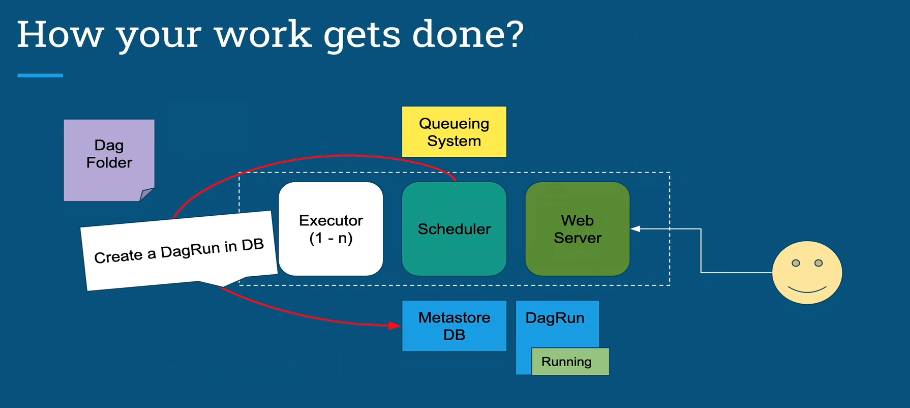
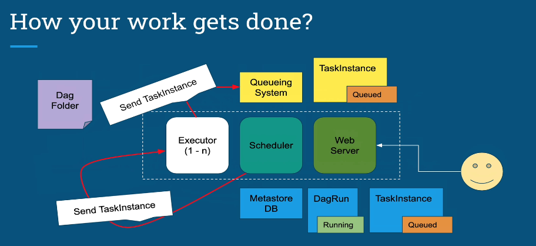
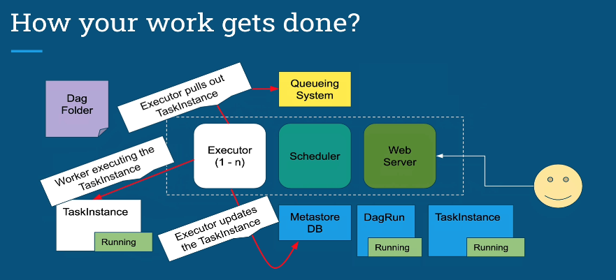
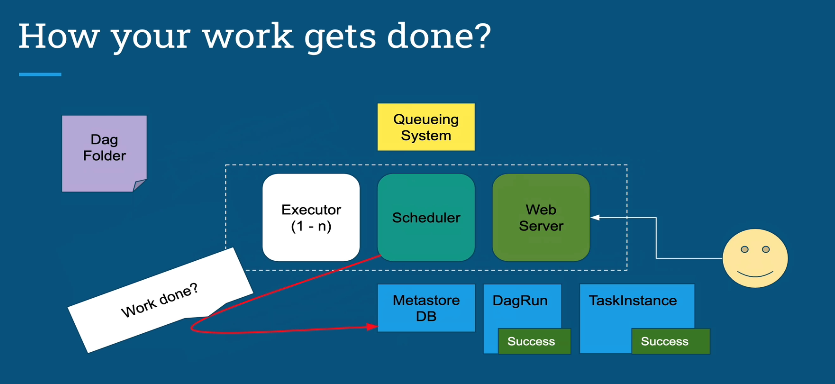

## Airflow Fundamental
### Memahami konsep dasar airflow bekerja

Termotivasi akan kebutuhan sistem manajemen alur kerja atau yang biasa disebut Workflow Management System (WMS) dalam praktik bisnis modern, yang menyediakan berbagai fitur dan fungsi yang lengkap juga dinamis, hal itulah yang mengarahkan kami untuk memilih Apache Airflow sebagai WMS pilihan kami.

Airflow merupakan Workflow Management System yang berarti:

- Mengelola penjadwalan dan menjalankan task untuk pipeline data (the 21st century of Mario Bros `Data Engineer`)

	

- Memastikan task berurutan dengan benar berdasarkan dependensinya (task bisa saja perintah apapun tidak melulu merupakan sebuah pipeline data)

- Mengelola alokasi sumber daya melalui penjadwalan resource (mematikan dan menghidupkan resource mesin melalui task perintah)

- Menyediakan mekanisme untuk melacak kondisi berbagai task dan memulihkannya dari kegagalan task

- Airflow sangat fleksibel dan dapat digunakan pada banyak domain

Artikel ini bertujuan untuk memberikan gambaran yang terperinci kepada pembaca yang penasaran dengan komponen dan cara Airflow beroperasi.

Kami akan membahas konsep utama Airflow

### Komponen utama pada Airflow

	

- Webserver: Proses ini menjalankan aplikasi Flask sederhana dengan gunicorn yang membaca status semua task dari database metadata dan membuat status ini untuk UI Web.
	- Web UI: Komponen ini memungkinkan pengguna di sisi klien untuk melihat dan mengedit status task dalam database metadata. Karena terpisahnya komponen antara Scheduler dan database, UI Web memungkinkan pengguna untuk memanipulasi aktivitas Scheduler.

- Scheduler: Scheduler atau Penjadwal adalah pemroses yang merupakan Daemon menggunakan definisi dari DAG dan hubungannya dengan Task dalam database metadata untuk memutuskan Task mana yang perlu dieksekusi, serta prioritas pelaksanaannya.
Scheduler umumnya dijalankan sebagai service.

- Database Metadata: basis data ini menyimpan informasi mengenai status dari Task.
Update dari database dilakukan dengan menggunakan lapisan abstraksi yang diimplementasikan pada SQLAlchemy.

- Executor: Executor adalah proses antrian pesan yang terikat erat dengan Scheduler dan menentukan proses Worker yang benar-benar melaksanakan setiap Task yang terjadwalkan.
Ada berbagai jenis Executor, masing-masing memiliki metoda khusus untuk Worker bekerja dan mengeksekusi Task.
Misalnya, LocalExecutor menjalankan tugas dengan proses paralel yang berjalan pada mesin yang sama dengan proses Scheduler.
Executor lainnya, seperti CeleryExecutor yang mengeksekusi Task menggunakan proses pekerja yang ada pada sekelompok mesin Worker yang terpisah.

- Workers: Ini adalah proses yang benar-benar melaksanakan logika Task, dan ditentukan oleh Executor yang digunakan.

### Konsep utama pada Airflow

	

Workflow adalah "DAGs" atau merupakan gabungan dari berbagai DAG yang terkoneksi dengan Sensor, Subdag atau metode lainnya. 

Workflow dalam Airflow adalah kumpulan Task yang memiliki dependensi terarah. Secara khusus, Airflow menggunakan grafik asiklik terarah (Directed Acyclic Graph) - atau DAG untuk singkatnya - untuk mewakili alur kerja. Setiap node dalam grafik adalah Task, dan penghubung atau Edges nya menentukan dependensi di antara Task (Grafik ini diharuskan menjadi asiklik sehingga tidak ada dependensi melingkar yang dapat menyebabkan loop eksekusi tanpa akhir).

Properties DAG yang paling utama di antaranya adalah:
- dag_id, pengidentifikasi unik di antara semua DAG
- start_date, yang merupakan titik waktu awal di mana Task pada DAG akan dimulai
- schedule_interval, yang merupakan interval waktu DAG tersebut dieksekusi

Selain dag_id, start_date, dan schedule_interval, setiap DAG dapat diinisialisasi dengan seperangkat default_arguments. Argumen default ini diwarisi ke semua Task pada DAG tersebut.

#### Operator, Sensor, dan Task
Meskipun DAG digunakan untuk mengatur Task dan mengatur konteks pelaksanaannya, DAGs tidak melakukan perhitungan yang sebenarnya.
Sebagai gantinya, Task adalah elemen dari Airflow yang melakukan pekerjaan yang ingin dilakukan.
Task dapat memiliki dua tipe:
- mereka dapat melakukan beberapa operasi eksplisit, dalam hal ini mereka adalah Operator, atau
- mereka dapat menghentikan sementara pelaksanaan tugas-tugas dependensi sampai beberapa kriteria telah terpenuhi, dalam hal ini mereka adalah Sensor.

#### DagRuns dan TaskInstances
Setelah kita mendefinisikan DAG, lalu kita telah membuat Task dan mendefinisikan dependensinya pada DAG - kita kemudian dapat menjalankan Task berdasarkan parameter DAG. Konsep kunci dalam Airflow adalah execution_time. Ketika Scheduler Airflow sedang berjalan, ia akan menentukan jadwal tanggal dengan interval yang teratur untuk menjalankan Task terkait DAG. Waktu pelaksanaan dimulai pada start_date DAG dan mengulangi setiap schedule_interval .
Sebagai contoh, waktu eksekusi yang dijadwalkan adalah (`2017–01–01 00:00:00`, `2017–01–02 00:00:00`, ...) .
Untuk setiap execution_time, DagRun dibuat dan beroperasi pada konteks waktu eksekusi itu. Jadi DagRun hanyalah DAG dengan waktu eksekusi tertentu.

Semua tugas yang terkait dengan DagRun disebut sebagai TaskInstances.
Dengan kata lain, TaskInstance adalah Task yang telah dipakai dan memiliki konteks execution_date.

DagRuns dan TaskInstances adalah konsep sentral dalam Airflow.
Setiap DagRun dan TaskInstance dikaitkan dengan entri dalam basis data metadata Airflow yang mencatat status mereka (mis. “queued”, “running”, “failed”, “skipped”, “up for retry”). 

Membaca dan memperbarui status ini adalah kunci untuk penjadwalan dan proses eksekusi pada Airflow.

- manfaat Airflow

	

- Airflow bukanlah

	

- Contoh Case penggunaan Airflow pada pipeline data

	

- Bagaimana cara mengelola begitu banyak jenis pipeline data

	

Airflow memiliki arsitektur modular dan menggunakan proses antrian pesan untuk mengatur jumlah Worker berapapun jumlahnya. Airflow siap untuk ditingkatkan hingga tak terbatas (Horizontal Scaling).

- arsitektur menggunakan satu node di Airflow

	

- arsitektur menggunakan multi-node di Airflow

	

- membandingkan dengan Google Composer
Bagaimana Warpin menggunakan Apache Airflow secara praktikal

	

#### Alur Kerja Airflow

- Pertama scheduler membaca folder DAG dan melihat apakah skripnya sudah memenuhi kriteria

	

- jika sudah memenuhi kriteria maka Scheduler akan membuat DagRun di DB, meregister skripnya maka DagRun berstatus Running

	

- Menjadwalkan TaskInstances untuk dijalankan, kemudian TaskInstance terjadwalkan

	

- Penjadwal mengirim TaskInstance ke Executor, Executor mengirim TaskInstance ke Sistem Antrian kemudian TaskInstance terantrikan

	

- Executor mengeluarkan TaskInstance kemudian memperbaharui TaskInstance di MetaDB untuk dijalankan, kemudian Worker yang mengeksekusi TaskInstance

	

- Setelah Tugas Selesai, Executor akan memperbarui TaskInstance ke `Success` tetapi DagRun masih berjalan ke Task berikutnya dalam Dag itu

	

- Setelah Semua Tugas Selesai dalam Dag, Scheduler akan memperbaharui status ke `Success` pada MetaDB DagRun, ataupun jika satu Task gagal DagRun akan memperbaharuinya ke `Failed`

	

- Web Server membaca MetaDB ke Pembaharuan UI

	

- Ringkasan Alur Kerja Airflow

	

1. Penjadwal membaca folder DAG
2. DAG Anda diuraikan oleh proses untuk membuat DagRun berdasarkan parameter penjadwalan DAG Anda
3. TaskInstance digunakan untuk setiap Tugas yang perlu dieksekusi dan ditandai ke "Dijadwalkan" dalam database metadata
4. Penjadwal mendapatkan semua TaskInstance yang ditandai "Dijadwalkan" dari metadata database, mengubah status menjadi "Antri" dan mengirimkannya ke pelaksana yang akan dieksekusi.
5. Pelaksana mengeluarkan Tugas dari antrian (tergantung pada pengaturan eksekusi Anda), mengubah status dari "Antri" menjadi "Berjalan" dan Pekerja mulai mengeksekusi TaskInstances
6. Ketika Tugas selesai, Pelaksana mengubah status tugas tersebut ke status finalnya (sukses, gagal, dll) dalam database dan DagRun diperbarui oleh Penjadwal dengan status "Sukses" atau "Gagal" tentu saja , server web secara berkala mengambil data dari metadaDB untuk memperbarui UI
