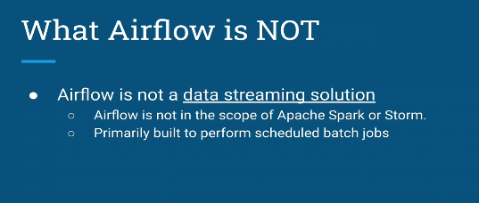
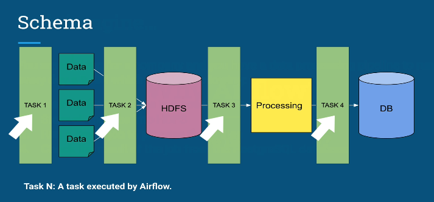
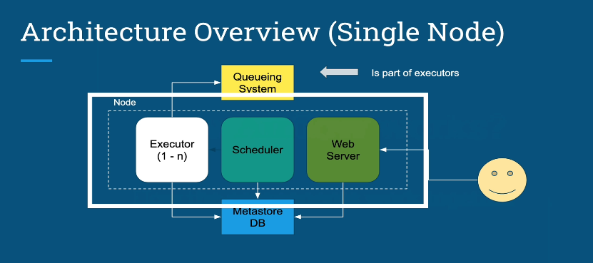
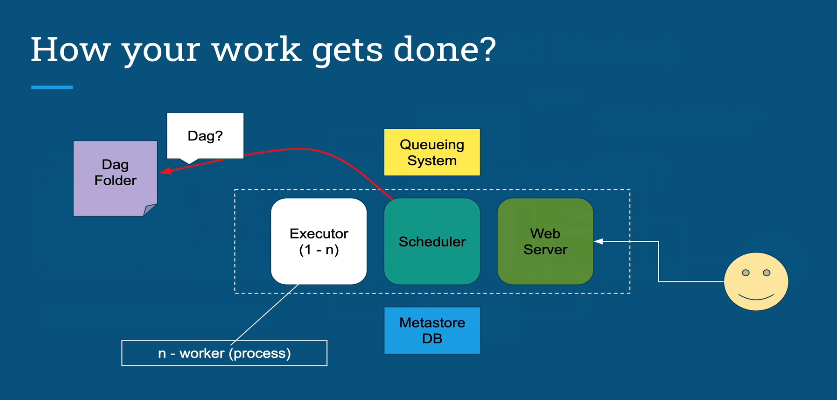
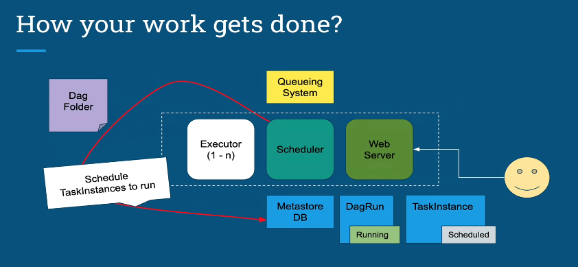
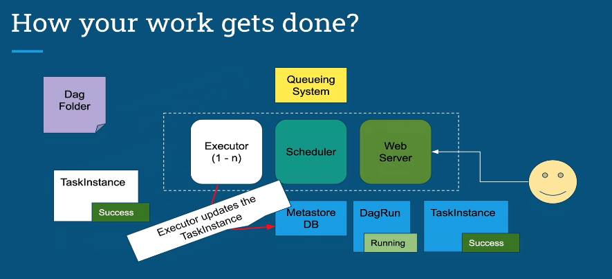
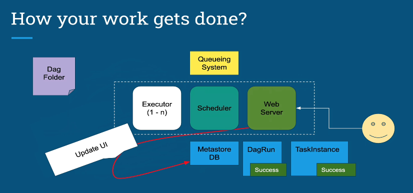

## Airflow Fundamental
### Konsep dasar airflow bekerja

- Komponen

	

- Konsep Kunci dalam Aliran Udara

	

- manfaat aliran udara

	

- ini bukan

	

- Kasing untuk utilitas aliran udara

	

- Bagaimana mengelola begitu banyak jenis pipa

	

- arsitektur menggunakan satu node

	

- arsitektur menggunakan banyak node

	

- membandingkan dengan Google Composer

	

- scheduler pertama membaca folder dan melihat apakah skripnya memenuhi kriteria

	

- jika bertemu maka buat DagRun di DB, daftarkan skripnya maka DagRun Sedang Berjalan

	

- jadwalkan TaskInances untuk dijalankan kemudian TaskInstance Dijadwalkan

	

- Penjadwal mengirim TaskInstance ke Executor, Executor mengirim TaskInstance ke Sistem Antrian kemudian TaskInstance Diantri

	

- Pelaksana mengeluarkan TaskInstance kemudian memperbarui TaskInstance di MetaDB untuk dijalankan, jadi kemudian Worker yang mengeksekusi TaskInstance

	

- Setelah Tugas Selesai, Pelaksana akan memperbarui TaskInstance ke Sukses tetapi DagRun masih berjalan ke tugas berikutnya dalam Dag itu

	

- Setelah Semua Tugas Selesai dalam Dag, Penjadwal akan memperbarui ke Sukses MetaDB DagRun, atau jika satu tugas gagal sehingga DagRun akan memperbarui ke Gagal

	

- Web Server membaca MetaDB ke Pembaruan UI

	

- Ringkasan

	

1. Penjadwal membaca folder DAG
2. DAG Anda diuraikan oleh proses untuk membuat DagRun berdasarkan parameter penjadwalan DAG Anda
3. TaskInstance digunakan untuk setiap Tugas yang perlu dieksekusi dan ditandai ke "Dijadwalkan" dalam database metadata
4. Penjadwal mendapatkan semua TaskInstance yang ditandai "Dijadwalkan" dari metadata database, mengubah status menjadi "Antri" dan mengirimkannya ke pelaksana yang akan dieksekusi.
5. Pelaksana mengeluarkan Tugas dari antrian (tergantung pada pengaturan eksekusi Anda), mengubah status dari "Antri" menjadi "Berjalan" dan Pekerja mulai mengeksekusi TaskInstances
6. Ketika Tugas selesai, Pelaksana mengubah status tugas tersebut ke status finalnya (sukses, gagal, dll) dalam database dan DagRun diperbarui oleh Penjadwal dengan status "Sukses" atau "Gagal" tentu saja , server web secara berkala mengambil data dari metadaDB untuk memperbarui UI
